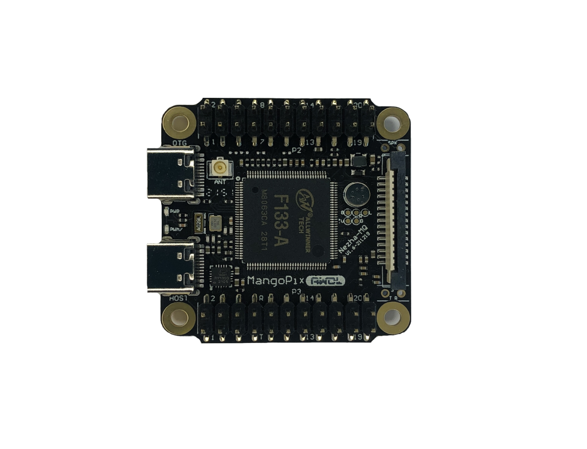
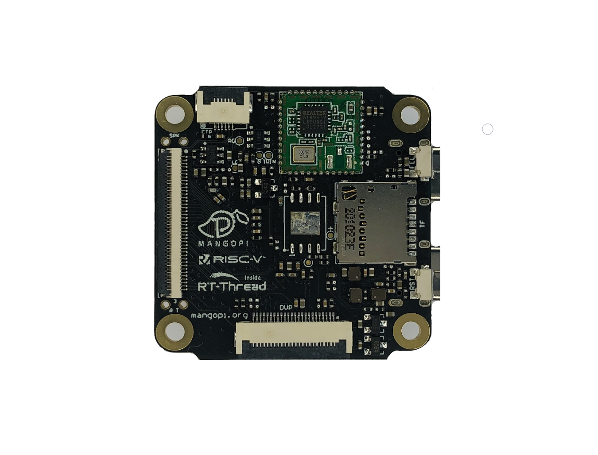
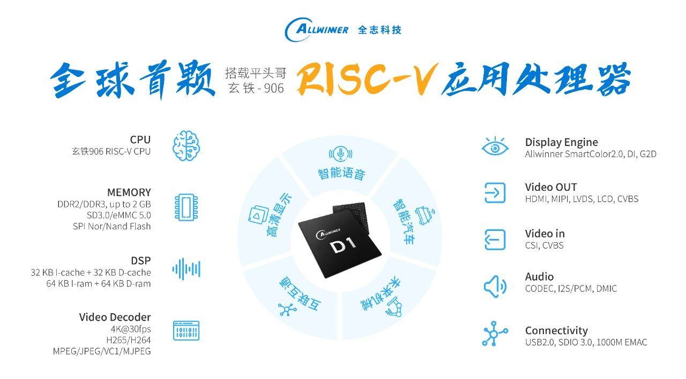

### MangoPi Nezha-MQ

### Introduction

This micro development board is specially designed to run Linux. Despite a mini body, it has all the vital functions. Equipped with D1s(RISC-V core) as the maincontroller chip, the board offers various commonly-used peripheral ports: GPIO, I2C & SPI, SDIO, Audio port(record, play), Video(RGB666 Display, touch, DVP, DSI and LVDS), USB Host, OTG, etc. Besides, the board comes with a built-in 64MB DDR and onboard WiFi, which fully supports Linux ecology and running complete Python.

### Spectification
  * D1s with 64MB DDR, RISC-V core up to 1GHz
  * USB-OTG Type-C
  * USB-HOST Type-C
  * 22Pin expand x2(all pins out)
  * TF card
  * RTL8189F WiFi or other WiFi/BT module
  * 15Pins DSI FPC connector
  * 40Pins RGB FPC connector
  * 6Pins CTP FPC connector
  * MIC x 1
  * 24Pins DVP FPC connector
  * Fel,reset button
  * 4x4cm size

